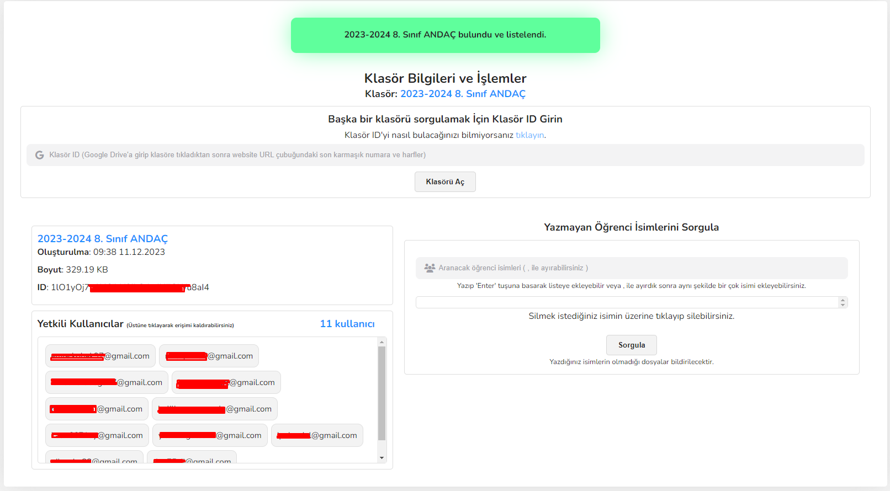

# Yardım - Kullanım
### ----Andaç Sistemi Kullanımı----------------------------------------------------------------
### [Kullanım Şartları](https://github.com/puffanee/puffanee-docs/blob/main/deu-andac-web/terms.md) | [Gizlilik Politikası](https://github.com/puffanee/puffanee-docs/blob/main/deu-andac-web/privay-policy.md) 

## Öncelikle giriş yapmak için ilk sayfada yapmanız gerekenler;
> 1- **Size ait olan referans kodunu girdikten sonra 'Google İle Devam Et' diyerek Andaç klasörünü oluşturduğunuz veya Andaç klasörünün sizin ile paylaşıldığı Google hesabınız ile sisteme giriş yapmalısınız.**
>
> 

## Giriş yaptıktan sonra;
> 2- **Menüden isterseniz sistemden çıkış yapabilir isterseniz yönetim paneline giriş yapabilirsiniz.**
>
> 

## Panele eriştikten sonra;
> 3- **Yeni bir Andaç klasörü oluşturabilir veya mevcut andaç klasörünün IDsini alarak (Nasıl alacağınız bilmiyorsanız:** [Google Drive Klasör ID Alma](https://github.com/puffanee/puffanee-docs/blob/main/deu-andac-web/drive-klasor-id-alma.md)) **işlem yapabilirsiniz.**
>
> 

## - Yeni Andaç Ekleme;
> 4- **Yeni bir andaç klasörü oluşturmak için paneldeki yeşil 'Yeni Andaç' butonuna tıkladıyın ve gelen izin isteğini onaylayın.**
>
> 5- **Daha sonra açılan kutuda klasör adı, erişim izni olacak e-posta adresleri (virgül ile ayırabilirsiniz) ve sınıf bilgileri ile birlikte öğrenci isimleri (Örneğin: 8/A Ahmet Mert Kaymaz, 8/B Mehmet Usta, virgül ile ayırabilirsiniz)**
>
> 

## - Andaç Klasörler İşlemleri;
> 6- **Klasör ID'yi girdikten sonra 'Klasörü Aç' diyerek klasörü açın. Eğer klasör gerçekten var ve klasöre erişiminiz de varsa klasör açılır.**
>
> 7- **Mavi ile işaretli olarak klasör adı ve altında bilgileri bulunmaktadır. Başka bir klasör sorgulamak istediğinzde direkt idyi girerek aynı işlemler ile açabilirsiniz.**
>
> 8- **Yetkili Kullanıcılar kısmında klasörde yetkisi olan tüm e-posta adresleri listelenir. Üstüne tıklayarak ve onaylarak e-posta adresini kaldırabilirsiniz. (Klasör sahibi kaldırılmaya çalışırsa sistem hata verir.)**
> 
> 

## - Yazmayan Öğrenci İsimleri Sorgulama;
> 9- **'Aranacak Öğrenci İsimleri' giriş kısmına 100'e kadar isim yazabilirsiniz. (Büyük-küçük harf duyarlılığı bulunmaktadır. Virgül ile ayrıabilirsiniz.) İsimleri girdikten sonra 'Enter'a basarak isimler listeye eklenmelidir. Eklenen isimlerin üstüne tıklayarak listeden kaldırabilirsiniz. Daha sonra 'Sorgula' butonuna basarak sorgulayın ve açılan kutudan işlemi takip edebilirsiniz. (İşlem yazıların uzunluğuna göre uzamaktadır fakat çok uzun süreler görüyorsanız sistemden çıkış yapın ve tekrar giriş yaparak tekrar deneyin.)**
>
> 10- **Bu işlem ile klasördeki tüm dosyaların içeriği taranarak listedeki isimler sorgulanmaktadır.**
>
> 10- **İşlem tamamlandığında her dosyanın adı ve içeriğinde bulunamayan isimler listelenmektedir. Kutucuğua tıklayarak dosya adı ve yazmayanlarını kopyalayabilirsiniz. Filtrele kısmından yazarak dosya adı veya öğrenci adına göre istedğiniz şekilde filtrelebilirisinz.**
> 
> 
> 
> 